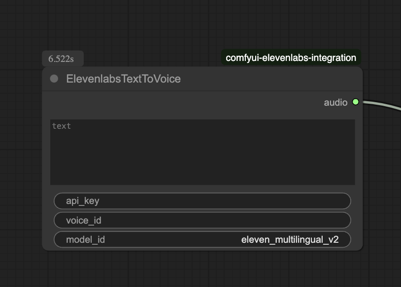
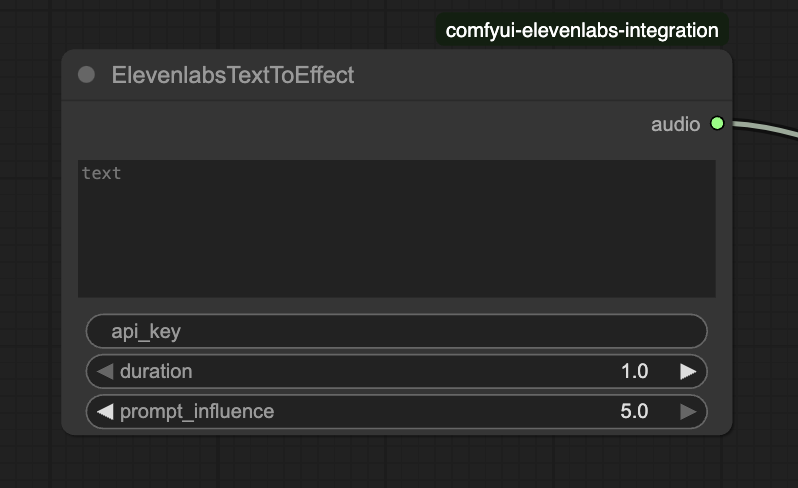

# ComfyUI ElevenLabs API integration
This ComfyUI node adds text-to-speech capabilities using the ElevenLabs API. If you enjoy using it and want to support my work, feel free to buy me a coffee — it’s much appreciated!

<a href="https://buymeacoffee.com/aoliao" target="_blank"></a>





## Installation

Install via the ComfyUI Manager or clone the repo into your `custom_nodes` folder:

```shell
git clone https://github.com/sysL-padawan/comfyui-elevenlabs-integration.git
```

Then change into the directory and install the dependencies:

```shell
pip install -r requirements.txt
```

Finally, restart ComfyUI.

## Nodes

Currently, there is one node for text-to-speech with ElevenLabs.

### ElevenlabsTextToVoice

- **api_key**: Your ElevenLabs API key
- **voice_id**: The voice ID from ElevenLabs
- **model_id**: The desired model (e.g. `eleven_multilingual_v2`)
- **text**: The text to be spoken
- **output_format**: Optional, e.g. `mp3_44100_128` (default)

The node returns an audio tensor and the sample rate, which can be used directly for e.g. LipSync.

## Example Workflow

1. Generate text-to-speech with ElevenLabs.
2. Use the audio output for LipSync or other audio applications.

### ElevenlabsTextToEffect

- **api_key**: Your ElevenLabs API key
- **text**: The text to be converted into a sound effect
- **duration**: (Optional) Length of the effect in seconds (default: 3, range: 1–22)
- **prompt_influence**: (Optional) Influence of the text prompt on the generated effect (default: 0.3, range: 0–1)
- **output_format**: (Optional) e.g. `mp3_44100_128` (default)

The node returns an audio tensor and the sample rate, which can be used directly for further audio applications.

## Example Workflow

1. Generate a sound effect from text with ElevenLabs.
2. Use the audio output for sound design, effects, or other audio applications.

## License

- [This repo](LICENSE)
- ElevenLabs API: see [https://elevenlabs.io/terms](https://elevenlabs.io/terms)

## Credits
- [ElevenLabs](https://elevenlabs.io/)
- [ComfyUI](https://github.com/comfyanonymous/ComfyUI)

